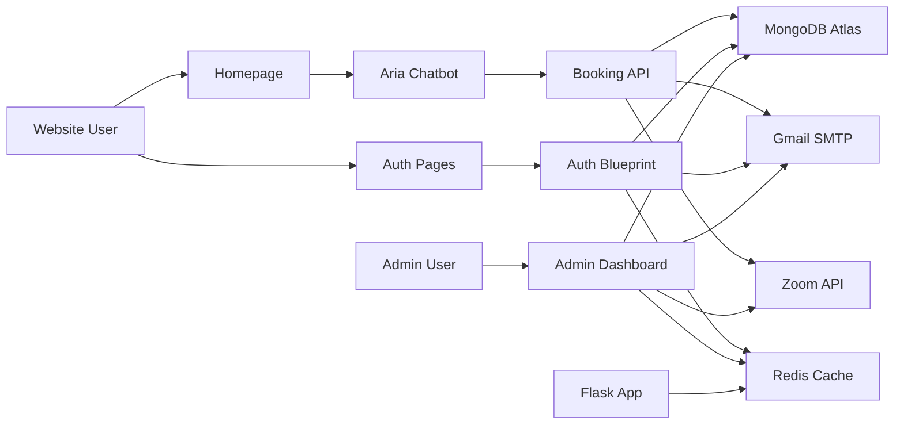
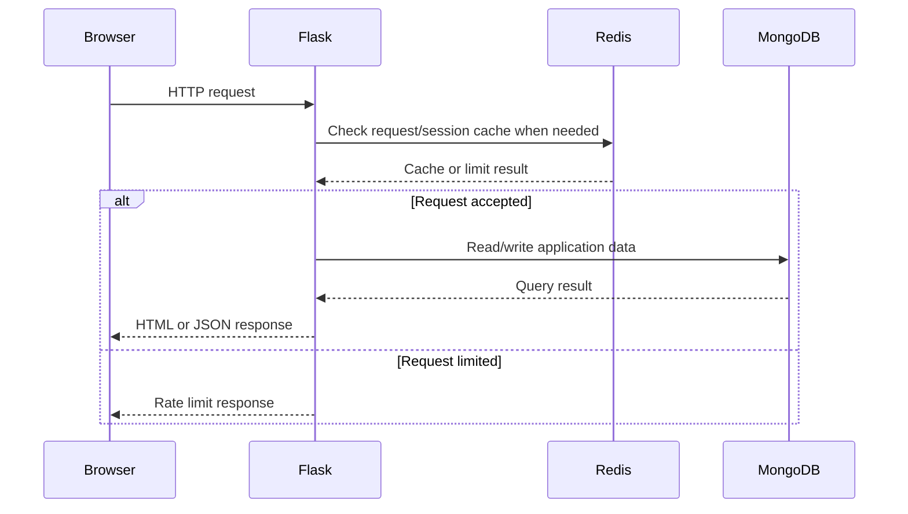
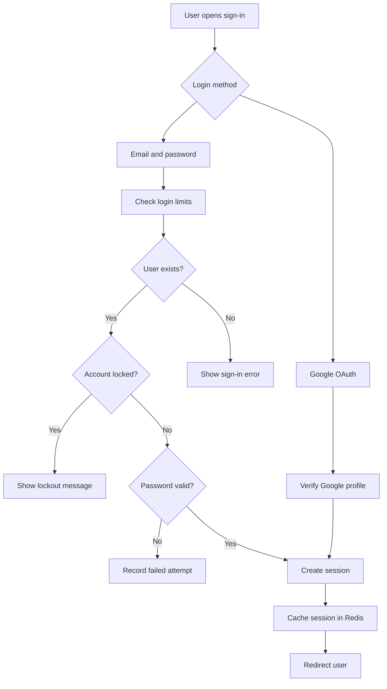
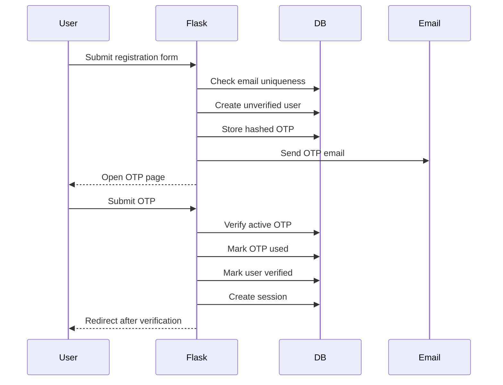
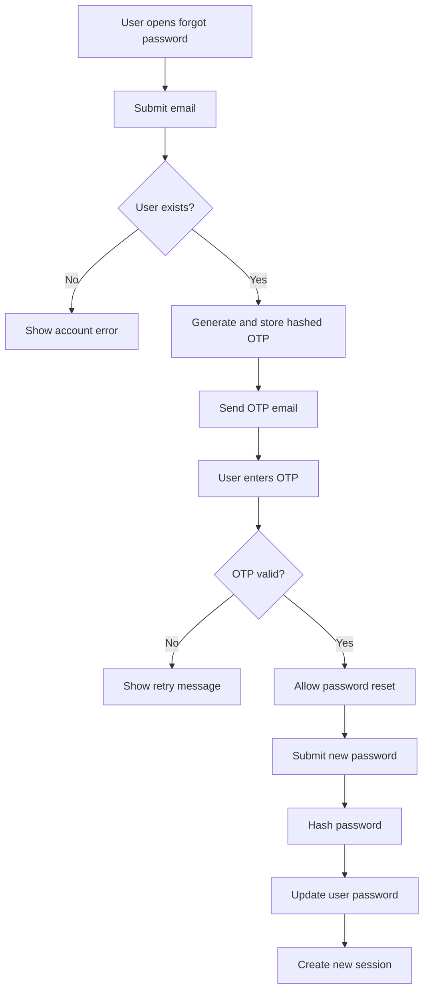
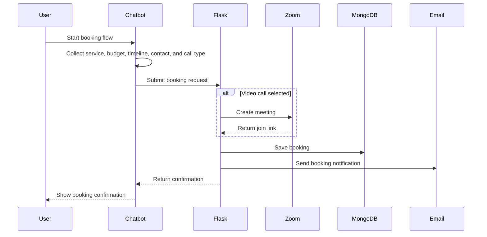
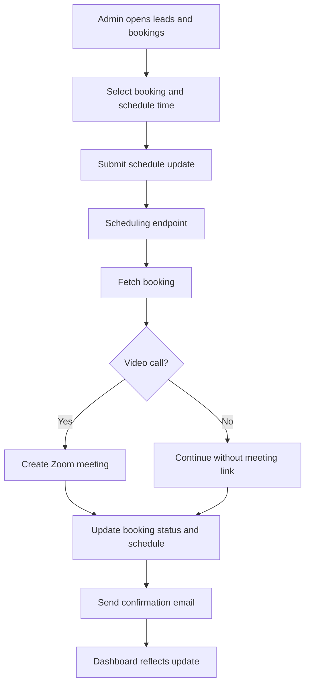
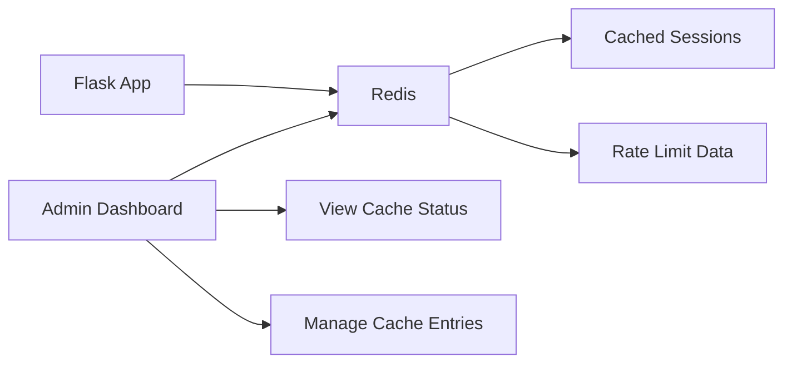
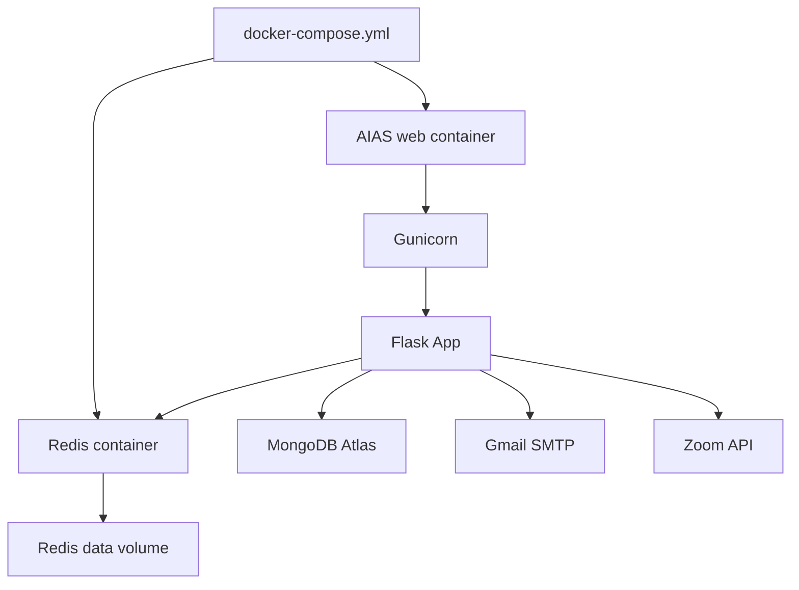

# AIAS


AIAS is a Flask-based business website and lead management platform. It provides a public website, secure user authentication, an Aria chatbot for lead capture, booking workflows, admin operations, MongoDB Atlas database persistence, Redis caching, email notifications, Zoom meeting support, and Docker-based deployment.

## Project Summary

AIAS includes:

- Public AIAS homepage
- User registration and sign-in
- Password reset with OTP
- Google OAuth sign-in
- Aria chatbot for lead qualification
- Booking capture for voice and video calls
- Zoom meeting creation for video consultations
- Email notifications through Gmail SMTP
- Admin dashboard for users, leads, security logs, Redis cache, database schema, and scheduling
- MongoDB Atlas database persistence
- Redis caching and rate limiting
- Docker deployment with a web container and Redis container

## Main Technology Stack

| Layer | Technology |
| --- | --- |
| Backend | Python 3.12, Flask |
| Auth helpers | Flask-Bcrypt, Flask-WTF CSRF, Authlib |
| Database | MongoDB Atlas through `pymongo` |
| Cache/rate limiting | Redis |
| Email | Gmail SMTP |
| Video meetings | Zoom Server-to-Server OAuth |
| Frontend | Jinja templates, HTML, CSS, vanilla JavaScript |
| Production server | Gunicorn |
| Deployment | Docker, Docker Compose |

## Project Structure

```text
AIAS/
  app.py
  config.py
  requirements.txt
  Dockerfile
  docker-compose.yml
  .dockerignore
  .gitignore
  .env.example
  information.md
  README.md

  auth/
    routes.py
    email_service.py
    google_oauth.py
    otp_service.py
    rate_limiter.py
    redis_service.py
    zoom_service.py

  database/
    db.py
    models.py
    security.py

  static/
    css/signin.css
    js/signin.js
    js/auth_features.js
    js/chatbot.js
    images/logo.png

  templates/
    homepage.html
    signin.html
    register.html
    verify_otp.html
    forgot_password.html
    reset_password.html
    dashboard.html
    admin.html
```

## Core Files

| File | Responsibility |
| --- | --- |
| `app.py` | Main Flask app factory, public routes, admin routes, booking endpoint, Redis/admin integrations, and cleanup hooks |
| `config.py` | Central environment/config loader for Flask, database, Redis, email, Google OAuth, and Zoom |
| `auth/routes.py` | Authentication blueprint for sign-in, registration, OTP, password reset, Google OAuth, sign-out, and dashboard |
| `auth/email_service.py` | Outbound OTP, welcome, booking, and notification emails |
| `auth/otp_service.py` | OTP generation, hashing, verification, expiry, and attempt handling |
| `auth/rate_limiter.py` | Login and OTP request limiting helpers |
| `auth/redis_service.py` | Redis client, session cache helpers, and rate-limit helpers |
| `auth/google_oauth.py` | Google OAuth client setup |
| `auth/zoom_service.py` | Zoom access token and meeting creation integration |
| `database/db.py` | MongoDB connection manager, indexes, and admin query helpers |
| `database/models.py` | User, OTP, and session data access models |
| `database/security.py` | Maintenance helpers, cleanup tasks, and health checks |
| `templates/homepage.html` | Public AIAS homepage |
| `templates/admin.html` | Admin dashboard UI |
| `static/js/chatbot.js` | Aria chatbot lead and booking flow |

## Database Tables

| Table | Purpose |
| --- | --- |
| `users` | Registered users, verification state, Google OAuth state, and login lockout data |
| `otp_codes` | Hashed OTP codes for registration and password reset |
| `sessions` | Login session records |
| `rate_limit_log` | Auth and rate-limit activity records |
| `bookings` | Chatbot leads, contact details, booking status, scheduled calls, and meeting links |

## High-Level Architecture



## Request Lifecycle



## Authentication Workflow



## Registration And OTP Workflow



## Password Reset Workflow



## Chatbot Lead Booking Workflow



## Admin Scheduling Workflow



## Redis Workflow



## Docker Deployment Architecture



## Docker Services

| Service | Purpose |
| --- | --- |
| `aias-platform` | Runs the Flask application through Gunicorn |
| `aias-redis` | Runs Redis for cache and rate-limit support |

The Docker setup builds the web app from `Dockerfile`, exposes port `5000`, uses environment values from `.env`, runs Redis with persistence, and includes container health checks.

## Environment Setup

Create a local `.env` from `.env.example`:

```powershell
copy .env.example .env
```

Fill in the required local values for Flask, MongoDB, Redis, SMTP, Google OAuth, Zoom, and admin configuration.

The real `.env` file must remain local and must not be committed.

## Run Locally

```powershell
python -m venv .venv
.\.venv\Scripts\Activate.ps1
pip install -r requirements.txt
python app.py
```

Open:

```text
http://127.0.0.1:5000
```

## Run With Docker

```powershell
docker compose up --build
```

Open:

```text
http://127.0.0.1:5000
```

## Deployment Commands

### Option 1: Docker Compose (Recommended)

Build and start:

```bash
docker compose up --build -d
```

Check status:

```bash
docker compose ps
```

View logs:

```bash
docker compose logs --tail=120 aias-web
docker compose logs --tail=120 aias-redis
```

Stop stack:

```bash
docker compose down
```

### Option 2: Standalone Docker CLI (Without Compose)

If you wish to deploy the containers manually using the `docker` CLI instead of `docker-compose`, use one of the following setups:

#### Setup A: Using a Shared Network (Recommended)
1. Create the bridge network:
   ```bash
   docker network create aias-network
   ```
2. Start the Redis container (named `aias-redis`):
   ```bash
   docker run -d --name aias-redis --network aias-network redis:7-alpine
   ```
3. Start the Web App container (named `aias-platform`):
   ```bash
   docker run -d --name aias-platform --network aias-network -p 5000:5000 --env-file .env -e REDIS_URL=redis://aias-redis:6379/0 aias-aias-web:latest
   ```

#### Setup B: Using Host Port Mapping
1. Start the Redis container:
   ```bash
   docker run -d --name aias-redis -p 6379:6379 redis:7-alpine
   ```
2. Start the Web App container pointing to your host's Redis loopback:
   ```bash
   docker run -d --name aias-platform -p 5000:5000 --env-file .env -e REDIS_URL=redis://host.docker.internal:6379/0 aias-aias-web:latest
   ```

---

## Smoke Test Checklist

```text
[ ] docker compose config --quiet
[ ] docker compose up --build -d
[ ] web container is healthy
[ ] redis container is healthy
[ ] / returns 200
[ ] /signin returns 200
[ ] /register returns 200
[ ] /forgot-password returns 200
[ ] Redis connectivity works from the web container
[ ] MongoDB connectivity works from the web container
[ ] No critical errors appear in container logs
```

## Useful Validation Commands

```bash
python -m compileall -q .
docker compose config --quiet
docker compose exec -T aias-platform python -m compileall -q .
docker compose exec -T aias-platform python -c "from app import create_app; app=create_app(); print(len(app.url_map._rules))"
```

## Production Notes

- Use production-grade secret storage for deployed credentials.
- Rotate credentials before first public deployment.
- Keep `.env` local and out of version control.
- Use HTTPS through a reverse proxy or platform load balancer.
- Keep Docker, Python dependencies, and system packages updated.
- Monitor application logs, container health, Redis health, and database connectivity.

## Documentation

For the complete internal project overview, see:

```text
information.md
```
