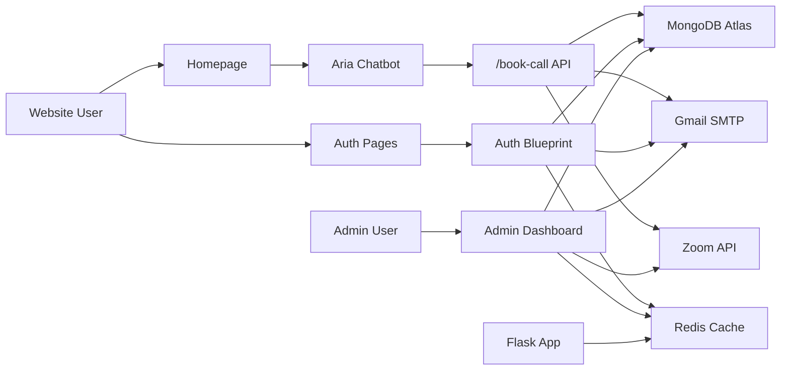
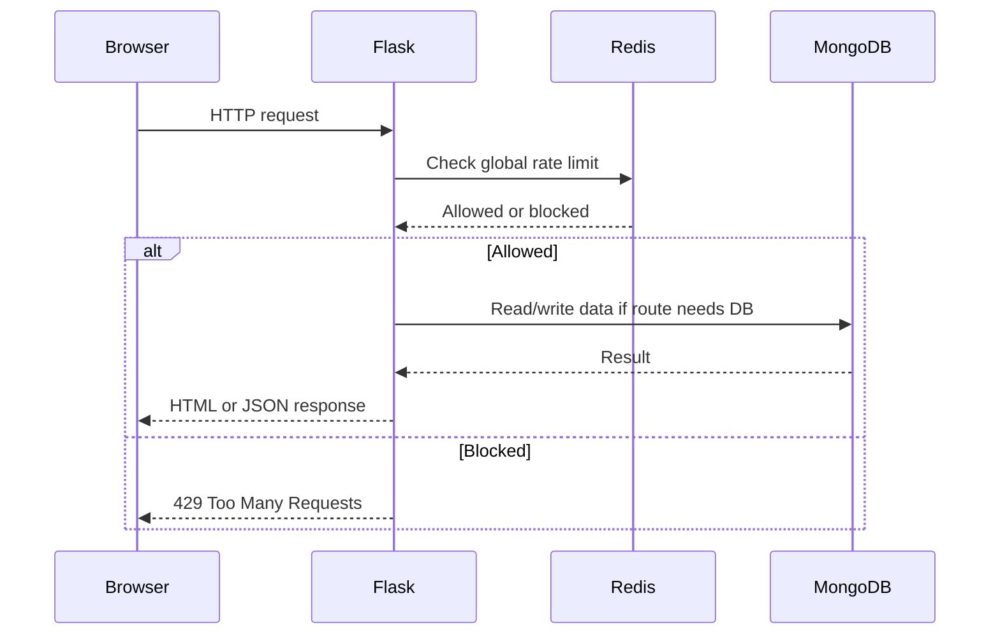
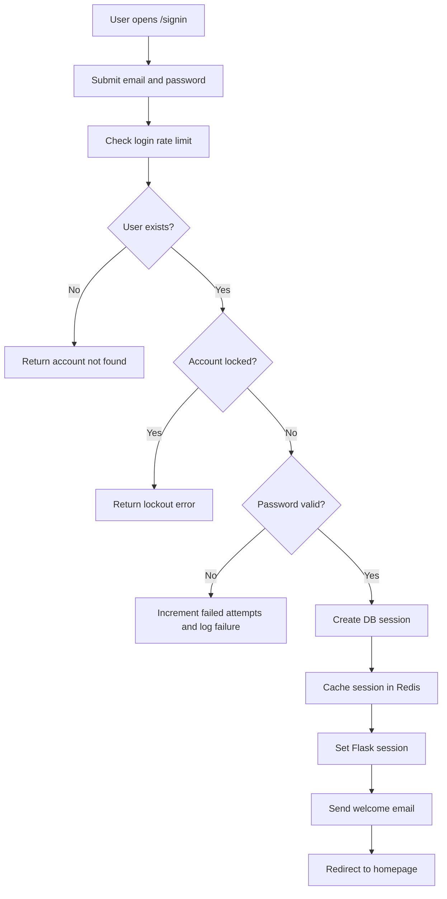
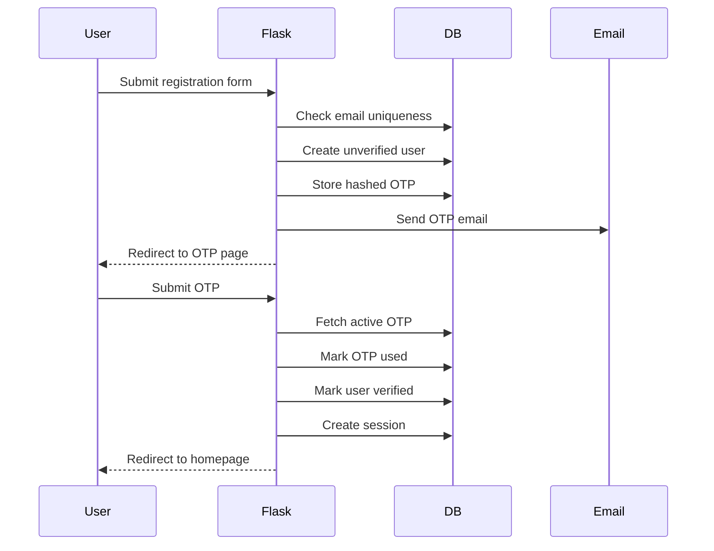
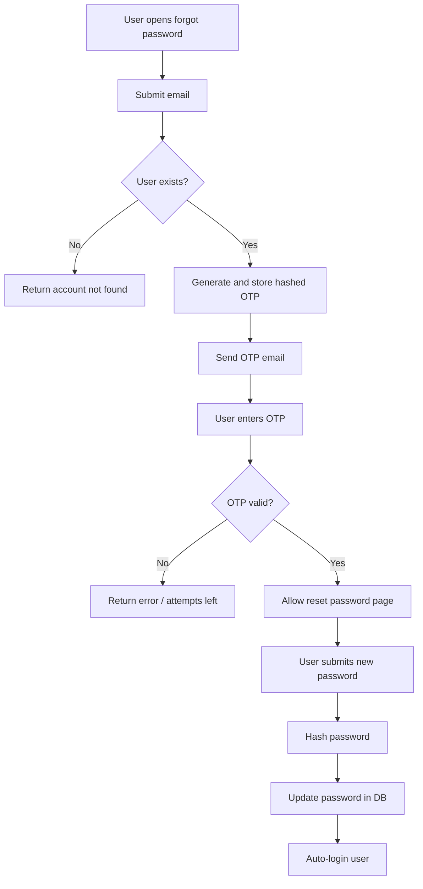
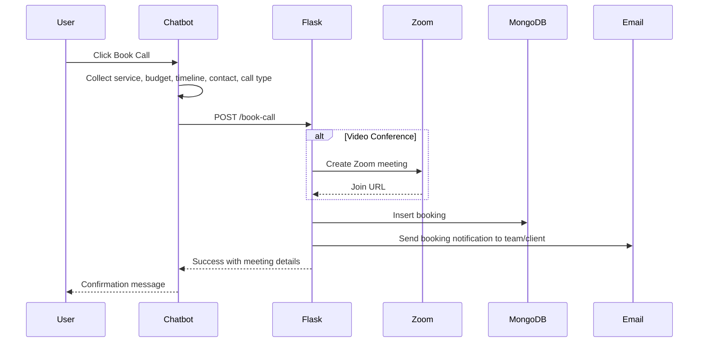
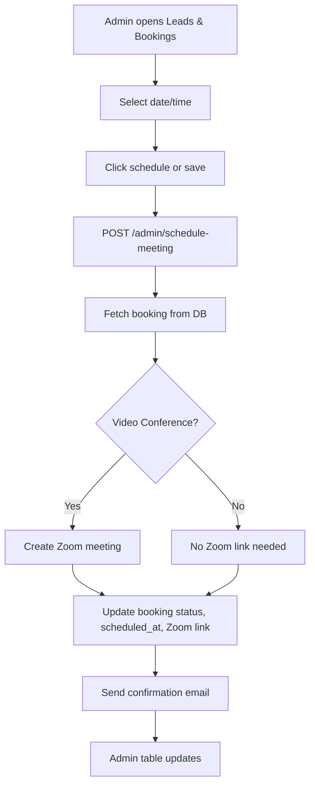
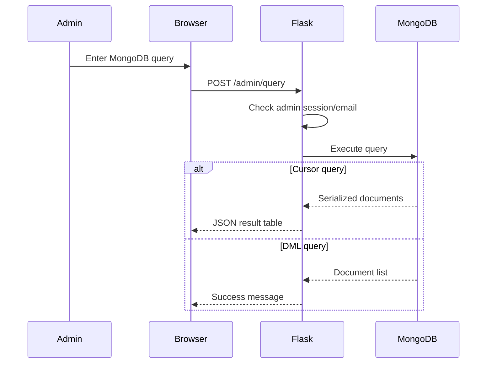
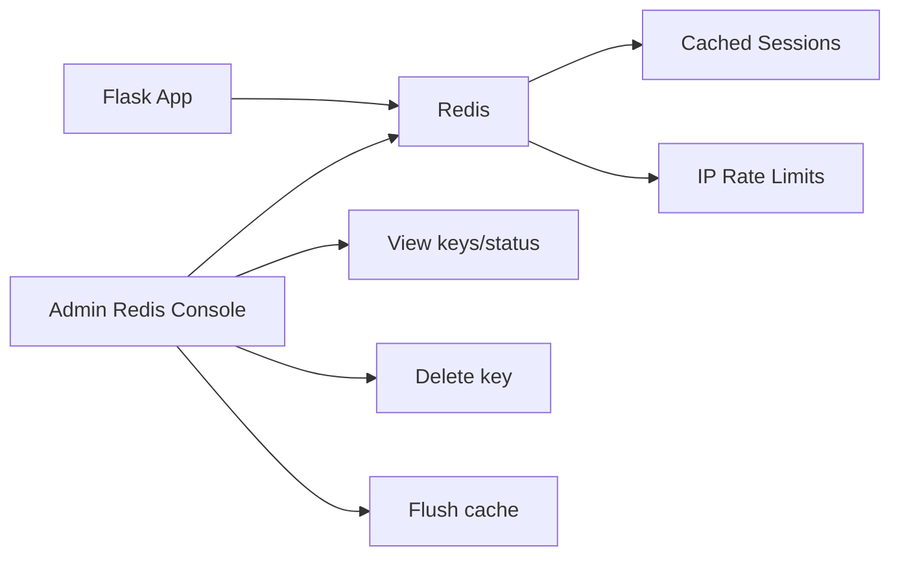
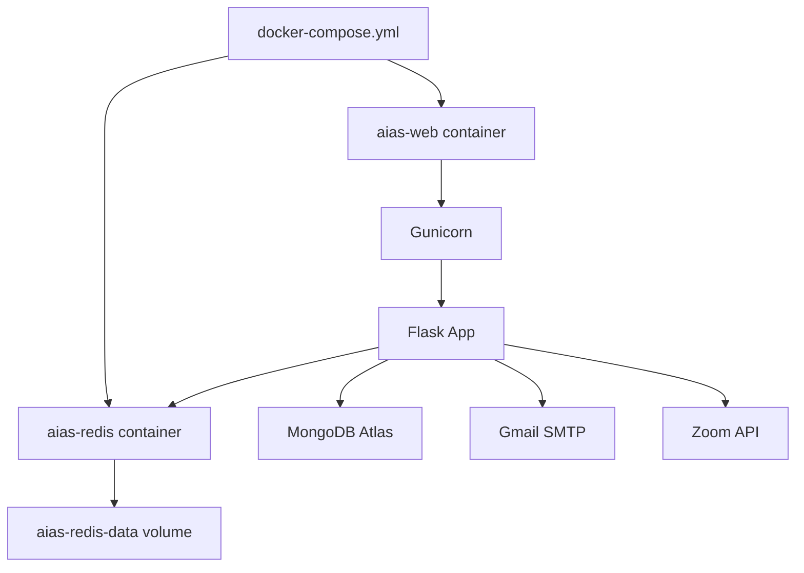

# AIAS Project Information

This document is the operational and technical overview for the AIAS Flask project. It explains what the project does, how each major piece works, how data moves through the system, and how the Docker deployment is structured.

## 1. Project Summary

AIAS is a Flask-based business website and lead management platform. It includes:

- Public AIAS homepage
- User registration and sign-in
- Password reset with OTP
- Google OAuth sign-in
- Aria chatbot for lead qualification
- Booking capture for voice/video calls
- Zoom meeting creation for video consultations
- Email notifications through Gmail SMTP
- Admin dashboard for users, leads, security logs, Redis cache, MongoDB console, and scheduling
- MongoDB Atlas database persistence
- Redis caching and rate limiting
- Docker deployment with a web container and Redis container

## 2. Main Technology Stack

| Layer | Technology |
| --- | --- |
| Backend | Python 3.12, Flask |
| Auth helpers | Flask-Bcrypt, Flask-WTF CSRF, Authlib |
| Database | MongoDB Atlas through `pymongo` |
| Cache/rate limiting | Redis |
| Email | Gmail SMTP |
| Video meetings | Zoom Server-to-Server OAuth |
| Frontend | Jinja templates, HTML, CSS, vanilla JavaScript |
| Production server | Gunicorn |
| Deployment | Docker, Docker Compose |

## 3. Project Structure

```text
AIAS/
  app.py
  config.py
  requirements.txt
  Dockerfile
  docker-compose.yml
  .dockerignore
  .gitignore
  .env.example
  information.md

  auth/
    routes.py
    email_service.py
    google_oauth.py
    otp_service.py
    rate_limiter.py
    redis_service.py
    zoom_service.py

  database/
    db.py
    models.py
    security.py

  static/
    css/signin.css
    js/signin.js
    js/auth_features.js
    js/chatbot.js
    images/logo.png

  templates/
    homepage.html
    signin.html
    register.html
    verify_otp.html
    forgot_password.html
    reset_password.html
    dashboard.html
    admin.html
```

## 4. Core Files and Responsibilities

### `app.py`

Main Flask application factory.

Responsibilities:

- Creates and configures the Flask app
- Enables CSRF protection
- Initializes bcrypt
- Registers auth blueprint
- Serves homepage
- Serves admin dashboard
- Handles admin MongoDB query execution
- Handles Redis admin inspection/delete/flush
- Receives chatbot booking submissions at `/book-call`
- Schedules or reschedules meetings from admin
- Applies global Redis-backed rate limiting
- Runs cleanup tasks occasionally

Important routes:

| Route | Purpose |
| --- | --- |
| `/` | Public homepage |
| `/admin` | Admin dashboard |
| `/admin/query` | Admin MongoDB query runner |
| `/admin/redis-status` | Redis status and key inspector |
| `/admin/redis-action` | Delete Redis key or flush Redis DB |
| `/book-call` | Chatbot booking endpoint |
| `/admin/schedule-meeting` | Admin schedule/reschedule endpoint |

### `config.py`

Central config loader.

Responsibilities:

- Loads `.env`
- Defines Flask secret/session settings
- Stores MongoDB URI
- Stores Gmail SMTP settings
- Stores OTP/rate-limit/session settings
- Stores Google OAuth settings
- Stores Zoom API settings
- Stores Redis URL

### `auth/routes.py`

Authentication blueprint.

Responsibilities:

- Sign in with email/password
- Register account
- Verify OTP for registration or password reset
- Resend OTP
- Forgot password
- Reset password
- Google OAuth login/callback
- Sign out
- Dashboard route
- `login_required` decorator

Important auth routes:

| Route | Purpose |
| --- | --- |
| `/signin` | Email/password sign-in |
| `/register` | New account registration |
| `/verify-otp` | OTP verification |
| `/resend-otp` | OTP resend |
| `/forgot-password` | Password reset start |
| `/reset-password` | Set new password after OTP |
| `/auth/google` | Start Google OAuth |
| `/auth/google/callback` | OAuth callback |
| `/signout` | Log out |
| `/dashboard` | Logged-in dashboard |

### `auth/email_service.py`

Sends all outbound email.

Responsibilities:

- Send OTP verification email
- Send welcome email
- Send booking confirmation/notification email
- Send client and team booking details

Uses:

- `smtplib`
- Gmail SMTP
- HTML email templates built in Python strings

### `auth/otp_service.py`

Handles OTP generation and verification.

Responsibilities:

- Generate secure 6-digit OTP
- Hash OTP with SHA-256
- Store OTP hash in database
- Verify submitted OTP
- Mark OTP as used
- Enforce max attempts
- Enforce expiry

### `auth/rate_limiter.py`

Database-backed rate limiter for auth actions.

Responsibilities:

- Limit OTP requests per email
- Limit failed login attempts
- Log successful and failed login actions

### `auth/redis_service.py`

Redis integration layer.

Responsibilities:

- Create Redis client from `REDIS_URL`
- Cache sessions
- Fetch/delete cached sessions
- Delete all cached sessions for a user
- Run Redis sorted-set rate limiting
- Fail open if Redis is unavailable

### `auth/google_oauth.py`

Google OAuth setup.

Responsibilities:

- Initialize Authlib OAuth client
- Register Google provider
- Provide Google client to routes

### `auth/zoom_service.py`

Zoom meeting integration.

Responsibilities:

- Fetch Zoom access token through Server-to-Server OAuth
- Create scheduled Zoom meetings
- Return meeting join URL
- Fail gracefully if Zoom credentials/API fail

### `database/db.py`

MongoDB connection manager and indexes manager.

Responsibilities:

- Create `pymongo` connections
- Wrap/sanitize MongoDB documents
- Enforce timezone-aware datetimes
- Execute eval queries
- Lazily create collections
- Create indexes

Collections indexed:

- `users`
- `otp_codes`
- `sessions`
- `rate_limit_log`
- `bookings`

### `database/models.py`

Data access models.

Responsibilities:

- `UserModel`: create/find/update users, lock/reset failed attempts
- `OTPModel`: create/fetch/update OTP codes
- `SessionModel`: create/fetch/delete sessions with Redis cache support

### `database/security.py`

Maintenance and logging helpers.

Responsibilities:

- Cleanup expired OTPs
- Cleanup expired sessions
- Cleanup old rate logs
- Log rate-limit events
- Count recent rate-limit events
- Check basic database connectivity

### `templates/homepage.html`

Public AIAS website.

Features:

- Cinematic intro
- Theme toggle
- Marketing sections
- CTA handling
- Account-aware navigation
- Chatbot launch hooks

### `static/js/chatbot.js`

Aria chatbot logic.

Responsibilities:

- Shows modal chatbot UI
- Requires login before booking call
- Collects lead details
- Collects project requirements
- Collects budget/timeline
- Lets user select voice/video call
- Submits booking to `/book-call`
- Stores previous lead details in browser local storage

### `templates/admin.html`

Admin dashboard.

Features:

- Stats cards
- Leads and bookings table
- User table
- User requirement cards
- Security/rate-limit logs
- MongoDB console
- Redis cache inspector
- Meeting scheduling/rescheduling
- Horizontal scroll for wide tabs/tables
- Professional SVG icons
- Light/dark theme toggle

## 5. MongoDB Collections Overview

### `users`

Stores registered users.

Key fields:

- `id`
- `email`
- `password_hash`
- `display_name`
- `is_google_user`
- `is_verified`
- `failed_login_attempts`
- `locked_until`
- `created_at`
- `updated_at`

### `otp_codes`

Stores hashed OTPs.

Key fields:

- `id`
- `email`
- `otp_hash`
- `purpose`
- `attempts`
- `max_attempts`
- `is_used`
- `created_at`
- `expires_at`

### `sessions`

Stores login sessions.

Key fields:

- `id`
- `user_id`
- `session_token`
- `created_at`
- `expires_at`

### `rate_limit_log`

Stores login/OTP/rate-limit events.

Key fields:

- `id`
- `email`
- `action`
- `created_at`

### `bookings`

Stores chatbot leads and scheduled calls.

Key fields:

- `id`
- `name`
- `email`
- `whatsapp`
- `service_needed`
- `budget_range`
- `timeline`
- `problem_statement`
- `source`
- `lead_status`
- `call_type`
- `zoom_meeting_link`
- `scheduled_at`
- `created_at`

## 6. High-Level System Architecture



## 7. Request Lifecycle



## 8. Authentication Workflow



## 9. Registration and OTP Verification Workflow



## 10. Password Reset Workflow



## 11. Chatbot Lead Booking Workflow



## 12. Admin Scheduling Workflow



## 13. Admin MongoDB Console Workflow



## 14. Redis Workflow



## 15. Docker Deployment Architecture



## 16. Docker Services

### `aias-web`

Runs the Flask app through Gunicorn.

Important settings:

- Image is built from `Dockerfile`
- Exposes container port `5000`
- Uses `.env`
- Sets `FLASK_ENV=production`
- Points `REDIS_URL` to `redis://aias-redis:6379/0`
- Depends on Redis health
- Runs as non-root user
- Uses healthcheck against `/`

### `aias-redis`

Runs Redis.

Important settings:

- Uses `redis:7-alpine`
- Enables append-only persistence
- Uses volume `aias-redis-data`
- Has healthcheck using `redis-cli ping`

## 17. Environment Variables

Required production variables:

| Variable | Purpose |
| --- | --- |
| `SECRET_KEY` | Flask session/CSRF secret |
| `FLASK_ENV` | `production` in deployed environment |
| `PORT` | App port, default `5000` |
| MONGO_URI | MongoDB Atlas connection string |
| `MAIL_USERNAME` | Gmail SMTP username |
| `MAIL_PASSWORD` | Gmail app password |
| `REDIS_URL` | Redis connection string |
| `GOOGLE_CLIENT_ID` | Google OAuth client ID |
| `GOOGLE_CLIENT_SECRET` | Google OAuth secret |
| `GOOGLE_REDIRECT_URI` | OAuth callback URL |
| `ZOOM_ACCOUNT_ID` | Zoom Server-to-Server account ID |
| `ZOOM_CLIENT_ID` | Zoom client ID |
| `ZOOM_CLIENT_SECRET` | Zoom client secret |

Tuning variables:

| Variable | Purpose |
| --- | --- |
| `WEB_CONCURRENCY` | Gunicorn worker count |
| `GUNICORN_THREADS` | Threads per worker |
| `GUNICORN_TIMEOUT` | Gunicorn request timeout |
| `GLOBAL_RATE_LIMIT_LIMIT` | Requests allowed in rate limit window |
| `GLOBAL_RATE_LIMIT_WINDOW` | Rate limit window in seconds |

Never commit `.env`.

## 18. Deployment Commands

### Option 1: Docker Compose (Recommended)

Build and start:

```bash
docker compose up --build -d
```

Check status:

```bash
docker compose ps
```

View logs:

```bash
docker compose logs --tail=120 aias-web
docker compose logs --tail=120 aias-redis
```

Stop stack:

```bash
docker compose down
```

Stop and delete Redis volume:

```bash
docker compose down -v
```

### Option 2: Standalone Docker CLI (Without Compose)

To run the containers individually using the `docker` command line:

#### Setup A: Shared Network Bridge
1. Create bridge network:
   ```bash
   docker network create aias-network
   ```
2. Run Redis container (name: `aias-redis`):
   ```bash
   docker run -d --name aias-redis --network aias-network redis:7-alpine
   ```
3. Run Web container (name: `aias-platform`):
   ```bash
   docker run -d --name aias-platform --network aias-network -p 5000:5000 --env-file .env -e REDIS_URL=redis://aias-redis:6379/0 aias-aias-web:latest
   ```

#### Setup B: Host Loopback Mapping
1. Run Redis container:
   ```bash
   docker run -d --name aias-redis -p 6379:6379 redis:7-alpine
   ```
2. Run Web container:
   ```bash
   docker run -d --name aias-platform -p 5000:5000 --env-file .env -e REDIS_URL=redis://host.docker.internal:6379/0 aias-aias-web:latest
   ```

---

## 19. Deployment Smoke Test Checklist

Use this checklist after deployment.

```text
[ ] docker compose config --quiet
[ ] docker compose up --build -d
[ ] docker compose ps shows web healthy
[ ] docker compose ps shows redis healthy
[ ] / returns 200
[ ] /signin returns 200
[ ] /register returns 200
[ ] /forgot-password returns 200
[ ] /admin redirects to /signin when logged out
[ ] Redis ping from web container works
[ ] MongoDB connection is healthy
[ ] MongoDB ping works from web container
[ ] No critical errors in web logs
```

Useful commands:

```bash
docker compose exec -T aias-web python -m compileall -q .
docker compose exec -T aias-web python -c "from app import create_app; app=create_app(); print(len(app.url_map._rules))"
docker compose exec -T aias-web python -c "from auth.redis_service import RedisService; c=RedisService.get_client(); print(bool(c and c.ping()))"
docker compose exec -T aias-web python -c "from database.db import db_manager; print(db_manager.health_check())"
```

## 20. Security Notes

Current security protections:

- CSRF protection enabled through Flask-WTF
- Session cookies are HTTP-only
- Secure cookies enabled outside development
- SameSite cookie policy set to `Lax`
- Passwords stored as bcrypt hashes
- OTPs stored as SHA-256 hashes, never plaintext
- OTP expiry and max attempts enforced
- Account lockout after repeated failed logins
- Redis global IP rate limiting
- Safe MongoDB queries used in model layer
- Admin routes check logged-in user and admin email

Security risks to watch:

- Admin MongoDB console executes raw Python-like queries for admins. Keep admin access restricted.
- Redis flush action clears sessions/rate limits. Keep admin access restricted.
- `.env` contains secrets and must never be committed.
- Production OAuth redirect URI must match deployed domain.
- Gmail app password should be rotated if exposed.
- Zoom credentials should be configured only in production secret storage.

## 21. Known Operational Notes

- The Docker image connects directly to MongoDB via pymongo.
- The app can serve public pages even if database-backed routes fail, so DB smoke tests are required before marking deployment healthy.
- Redis failures are designed to fail open for some app flows, but production should still run Redis.
- The admin dashboard has horizontal scrolling for wide sections and tables.
- The MongoDB Console executes on Enter. Use Shift + Enter for a new line.

## 22. Suggested Production Hardening

Recommended next steps before public production:

- Move hardcoded admin emails into environment variables.
- Restrict or remove raw MongoDB console in production, or make it read-only.
- Add structured logging.
- Add automated tests for auth, booking, Redis, and admin authorization.
- Add a `/healthz` endpoint that checks app, Redis, and optionally database connectivity.
- Add HTTPS and secure proxy headers at the reverse proxy layer.
- Rotate all credentials before first public deployment.

